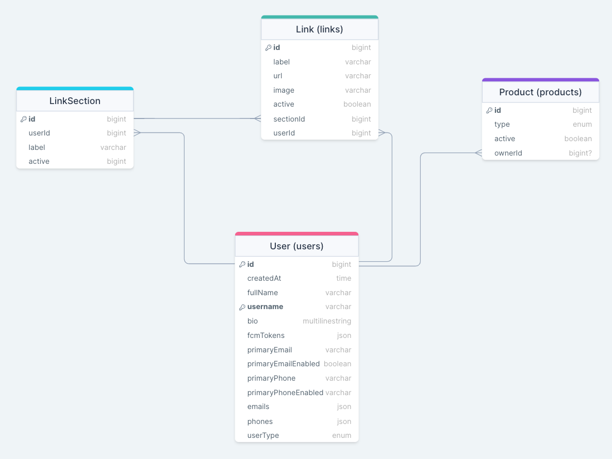

# Knot Task

- Create a Full-stack application similiar to the concept of Knot:

  - Database of your choosing (preferably MongoDB). Don't use ORMs
  - Server/API (must be Node.js)(preferably Express or Nest)
  - Front-end (React.js)
  - Auth using JWT

- Bonus:

  - if you containrize the whole setup that you would be a great addition.

  ## Database

  

- The Schema above describes the basic data structure:
  - This data structure is mainly designed with SQL in mind. if you use mongo you can modify the structure to fit mongo.
  - You are allowed to add any extra data or constraints(indices, foreign keys, ...) on the data.
  
- Enums:
  - UserType:
    - INDIVIDUAL
    - BUSINESS
    - ADMIN
    - CUSTOMER_SERVICE
  - ProductType:
    - CARD
    - KEYCHAIN
    - STICKER

## Server/API

- The api endpoints should follow the standards and convention of rest and strict naming patterns.
- The server files should be structured and organized. I don't want to see huge files containing alot of functions and classes.
- Authentication should be done with JWT.
- Main queries and mutations:
  - User:
    - Get User
      - With (one or more of the following):
        - Prodcuts
        - Link Sections and Links
    - Create User
    - Update User
      - Any data in the main table
      - Links
        - Link Section (add, edit, delete(CASCADE) )
        - Links (add, edit, delete, move to different section)
    - Delete User.
  - Product
    - Get:
      - By:
        - ID
        - OwnerId
      - with:
        - Owner
    - Update:
      - Activate/Deactivate
      - Connect/Disconnect to owner.

## Front-end

- Simple clean front end that demonstrates the functions of the app (ie; all the endpoints)
- Main Pages:
  - User Profile ( View and Edit)
  - User Link Sections and Links
    - Rename Section
    - Edit Link
      - url and name
  - User Products
    - View Product List
    - Connect Product using Id
    - Disconnect Product
