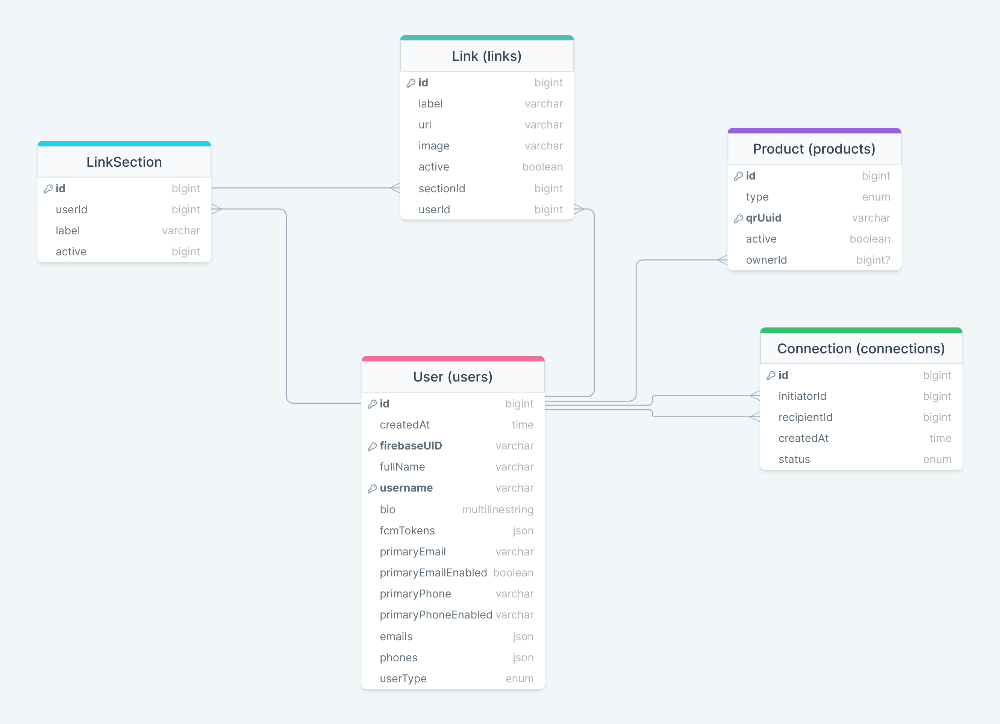

# Knot Task

- Create a Full-stack application similiar to the concept of Knot:

  - Database of your choosing (preferably MongoDB). Don't use ORMs
  - Server/API (must be Node.js)(preferably Express or Nest)
  - Front-end (preferably React.js)
  - Firebase Auth ( create a sample project, you can delete after task)

- Bonus:

  - if you containrize the whole setup that you would be a great addition.

  ## Database

  

- The Schema above describes the basic data structure:
  - This data structure is mainly designed with SQL in mind. if you use mongo you can modify the structure to fit mongo.
  - You are allowed to add any extra data or constraints(indices, foreign keys, ...) on the data.
  - in the users table, you'll notice that the user.id  and user.firebaseUID are two different columns. this is to let you know that we're using firebase auth and that the user is queried by the fireUID. depending on the database you can have id = firebaseUID and avoid the extra column, but some database require that the id be of the type BigInt or ObjectID or ..., so depending on your choice you can modify these two columns.
- Enums:
  - UserType:
    - INDIVIDUAL
    - BUSINESS
    - ADMIN
    - CUSTOMER_SERVICE
  - ProductType:
    - CARD
    - KEYCHAIN
    - STICKER
  - ConnectionStatus:
    - PENDING
    - ACCEPTED
    - REJECTED
    - BLOCKED

## Server/API

- The api endpoints should follow the standards and convention of rest and strict naming patterns.
- The server files should be structured and organized. I don't want to see huge files containing alot of functions and classes.
- Authentication should be done with JWT (firebase).
- Main queries and mutations:
  - User:
    - Get User
      - By:
        -  Id
        - FirebaseUID
      - With (one or more of the following):
        - Prodcuts
        - Connections (with other user)
        - Link Sections and Links
    - Create User
    - Update User
      - Any data in the main table
      - Links
        - Link Section (add, edit, delete(CASCADE) )
        - Links (add, edit, delete, move to different section)
    - Delete User.
    - Connections:
      - Initiate conncetion
      - Cancel connection request
      - End Connection.
      - Accept
      - Reject
      - Block
  - Product
    - Get:
      - By:
        - ID
        - Type
        - QrUuid
        - OwnerId
      - with:
        - Owner
    - Update:
      - Activate/Deactivate
      - Connect/Disconnect to owner.

## Front-end

- Simple clean front end that demonstrates the functions of the app (ie; all the endpoints)
- Main Pages:
  - User Profile ( View and Edit)
  - User Link Sections and Links
    - Rename Section
    - Edit Link
      - url and name
  - User Connections with users
    - End Connection
    - Block
  - User Connection Requests (Intiated and Recieved)
    - Accept
    - Reject
    - Cancel
  - User Products
    - View Product List
    - Activate/Deactivate Product
    - Unlink Product
